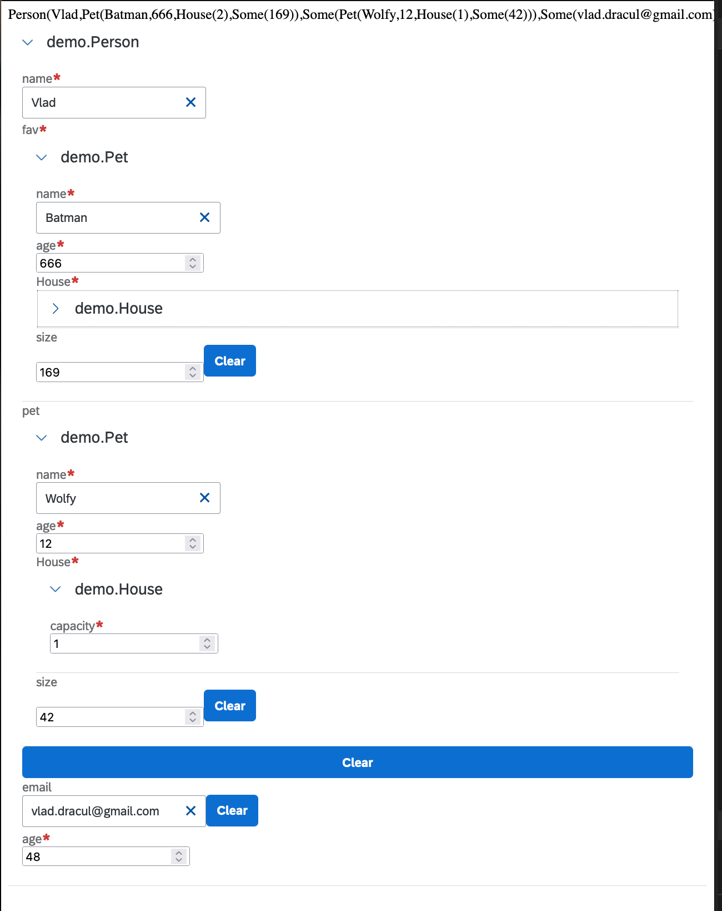

# laminar-form-derivation

This project derive UI Form for [laminar](https://laminar.dev/) with magnolia.


## Demo

[Live demo](https://cheleb.github.io/laminar-form-derivation/)

## Installation

libraryDependencies += "dev.cheleb" %%% "laminar-form-derivation" % "0.4.3"

## Run the example


Client side is reloaded in dev mode with [vite](https://vitejs.dev/), server side is built with [sbt](https://www.scala-sbt.org/)


Client code is in [example/client](./example/client/src/main/scala/HelloWorld.scala)

### Development

* VSCode with metals

Just open the project with vscode and enjoy [the magic](.vscode/tasks.json)

 ```bash
 code .
 ```

* Manual

With vite hot reload

 * Teminal 1 

```bash
sbt clean
DEV=1 sbt "~client/fastLinkJS"
```

 * Terminal 2
 ```bash
  cd example/client
  npm install
  npm run dev
  ```

Open http://localhost:3000, changes are hot reloaded in the browser when you save the [HelloWorld.scala](./example/client/src/main/scala/HelloWorld.scala).

### Production mode 

With a ZIO http server (work in progress)

```bash
sbt server/run  
```

Open http://localhost:8080

With server restart on change

```bash
sbt "~server/reStart"
```

Reload the page to see the changes...


## Sample Usage

```scala
package demo

import dev.cheleb.scalamigen.*
import dev.cheleb.scalamigen.Form.given
import org.scalajs.dom
import com.raquo.laminar.api.L.*

// Define some models
case class Person(
    name: String,
    fav: Pet,
    pet: Option[Pet],
    email: Option[String],
    age: Int
)
case class Pet(name: String, age: Int, House: House, size: Option[Int])

case class House(capacity: Int)

// Provide default for optional
given Defaultable[Pet] with
  def default = Pet("No pet", 0, House(0), None)

// Instance your model
val agnes =
  Person(
    "Vlad",
    Pet("Batman", 666, House(2), Some(169)),
    Some(Pet("Wolfy", 12, House(1), Some(42))),
    Some("vlad.dracul@gmail.com"),
    48
  )

val itemVar = Var(agnes)

object App extends App {

  val myApp =
    div(
      child <-- itemVar.signal.map { item =>
        div(
          s"$item"
        )
      },
      Form.renderVar(itemVar)
    )

  val containerNode = dom.document.getElementById("root")
  render(containerNode, myApp)
}

```

Renders the following form:




More info in the [example](./example/client/src/main/scala/HelloWorld.scala)


