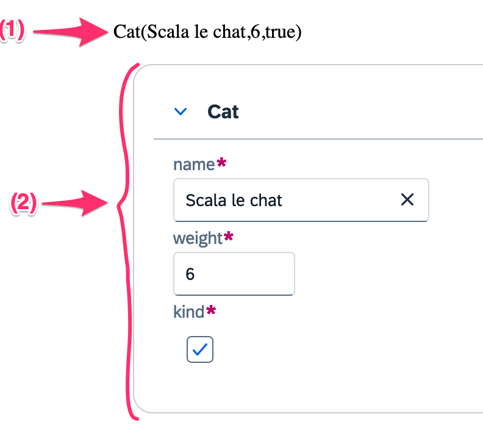

# Getting Started

## Installation

```sbt
// With raw Laminar widgets (html only)
libraryDependencies += "dev.cheleb" %%% "laminar-form-derivation-ui" % "{{ projectVersion }}"
// With UI5 Web Components
libraryDependencies += "dev.cheleb" %%% "laminar-form-derivation-ui5" % "{{ projectVersion}}"
```

Annoations allow to customize the form rendering. They are part of the `laminar-form-derivation-shared` package.

```sbt
libraryDependencies += "dev.cheleb" %%% "laminar-form-derivation-shared" % "{{ projectVersion }}"
```

## Sample

```scala sc:nocompile

// Declare model case class
case class Cat(name: String, age: Int)
case class Dog(name: String, age: Int)

case class EitherSample(
    either: Either[Cat, Dog],
    optionalInt: Option[Int]
    kind: Boolean = true
)

// Laminar variable binding
val eitherVar = Var(EitherSample(Left(Cat("Scala le chat", 6)), Some(1)))

div(
  // (1) Debug output of the model as soon as it changes.
  child <-- eitherVar.signal.map { item =>
    div(
      s"$item"
    )
  },
  // (2) Render the forms
  Form.renderVar(eitherVar)
)

```

Will be rendered as:

