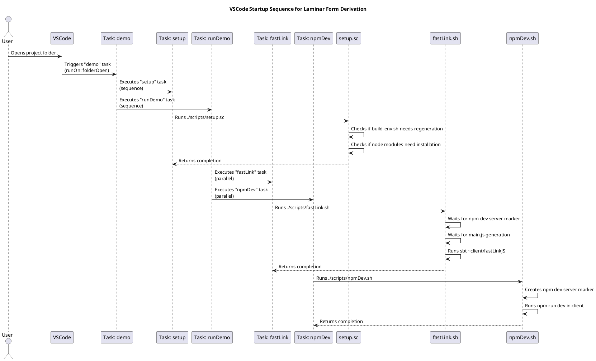

# VSCode development Setup

This document explains the setup process when opening the project in VSCode.

The sequence diagram shows:

When VSCode opens the project folder, it automatically triggers the "demo" task

The "demo" task runs the "setup" task first, then the "runDemo" task
* The "setup" task runs the Scala script that checks build environment and node modules
* The "runDemo" task runs "fastLink" and "npmDev" tasks in parallel
  * "fastLink" waits for the npm dev server to start and then runs the Scala.js fastLink compilation
  * "npmDev" starts the npm development server for the client

The key files involved are:

* .vscode/tasks.json - Defines the task dependencies and execution order
* scripts/setup.sc - Handles project setup and environment checks
* scripts/fastLink.sh - Manages the Scala.js compilation process
* scripts/npmDev.sh - Starts the npm development server